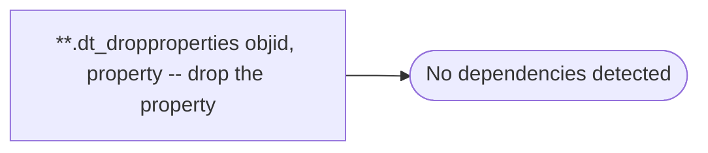

# **.dt_dropproperties objid, property -- drop the property

**Database:** fn_01  
**Server:** bedrockdb02  

## Architecture Diagram



## Table Dependencies

_No table references detected._

## Stored Procedure Code

```sql

```

