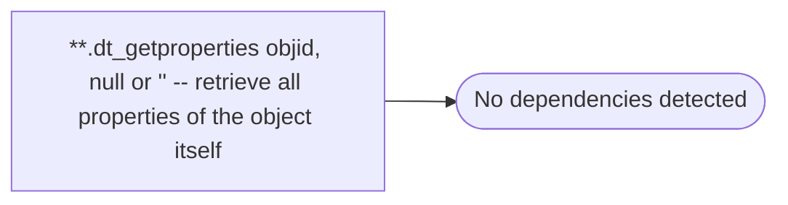

# **.dt_getproperties objid, null or '' -- retrieve all properties of the object itself

**Database:** fn_01  
**Server:** bedrockdb02  

## Architecture Diagram



## Table Dependencies

_No table references detected._

## Stored Procedure Code

```sql

```

