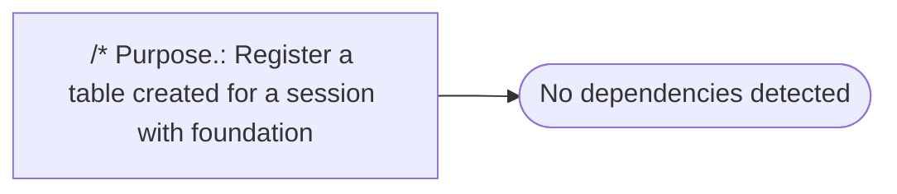

# /* Purpose.: Register a table created for a session with foundation

**Database:** fn_01  
**Server:** bedrockdb02  

## Architecture Diagram



## Table Dependencies

_No table references detected._

## Stored Procedure Code

```sql
*/
```

