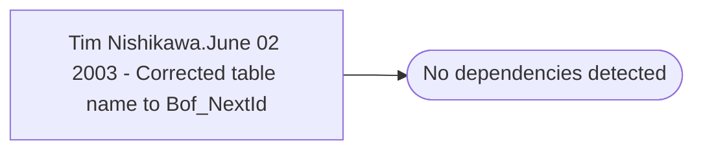

# Tim Nishikawa.June 02 2003 - Corrected table name to Bof_NextId

**Database:** fn_01  
**Server:** bedrockdb02  

## Architecture Diagram



## Table Dependencies

_No table references detected._

## Stored Procedure Code

```sql

```

