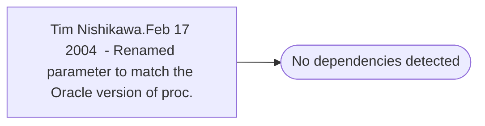

# Tim Nishikawa.Feb 17 2004  - Renamed parameter to match the Oracle version of proc.

**Database:** fn_01  
**Server:** bedrockdb02  

## Architecture Diagram



## Table Dependencies

_No table references detected._

## Stored Procedure Code

```sql

```

