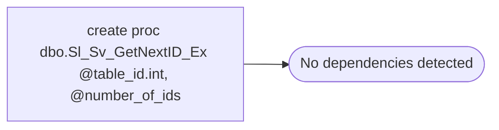

# create proc dbo.Sl_Sv_GetNextID_Ex @table_id.int, @number_of_ids

**Database:** fn_01  
**Server:** bedrockdb02  

## Architecture Diagram



## Table Dependencies

_No table references detected._

## Stored Procedure Code

```sql
int
```

