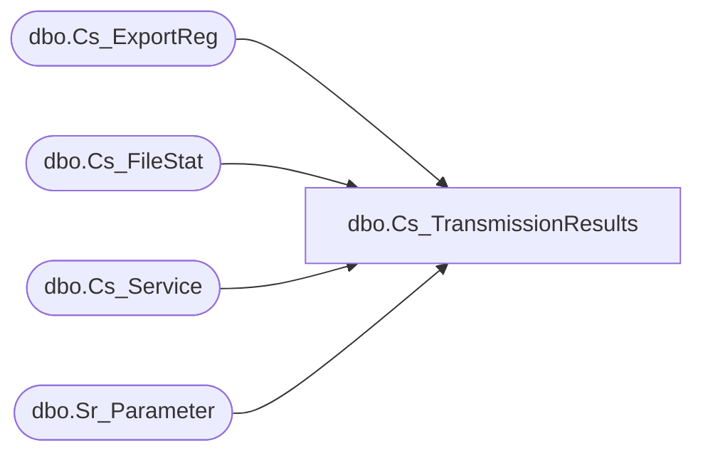

# dbo.Cs_TransmissionResults

**Database:** fn_01  
**Server:** bedrockdb02  

## Architecture Diagram



## Table Dependencies

| Referenced Table |
|---|
| dbo.Cs_ExportReg |
| dbo.Cs_FileStat |
| dbo.Cs_Service |
| dbo.Sr_Parameter |

## Stored Procedure Code

```sql

```

