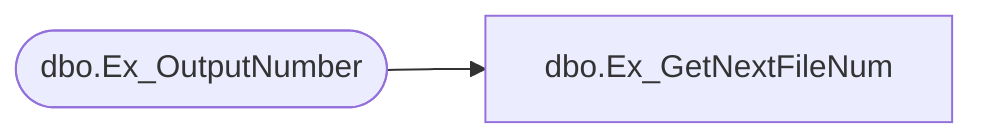

# dbo.Ex_GetNextFileNum

**Database:** fn_01  
**Server:** bedrockdb02  

## Architecture Diagram



## Table Dependencies

| Referenced Table |
|---|
| dbo.Ex_OutputNumber |

## Stored Procedure Code

```sql

```

