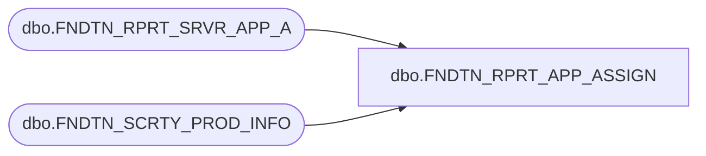

# dbo.FNDTN_RPRT_APP_ASSIGN

**Database:** fn_01  
**Server:** bedrockdb02  

## Architecture Diagram



## Table Dependencies

| Referenced Table |
|---|
| dbo.FNDTN_RPRT_SRVR_APP_A |
| dbo.FNDTN_SCRTY_PROD_INFO |

## Stored Procedure Code

```sql

```

