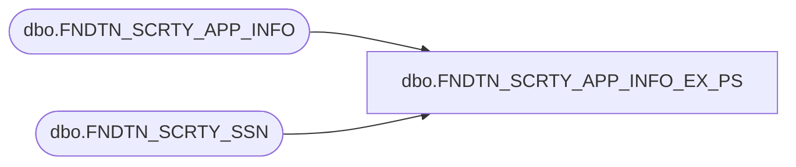

# dbo.FNDTN_SCRTY_APP_INFO_EX_PS

**Database:** fn_01  
**Server:** bedrockdb02  

## Architecture Diagram



## Table Dependencies

| Referenced Table |
|---|
| dbo.FNDTN_SCRTY_APP_INFO |
| dbo.FNDTN_SCRTY_SSN |

## Stored Procedure Code

```sql

```

