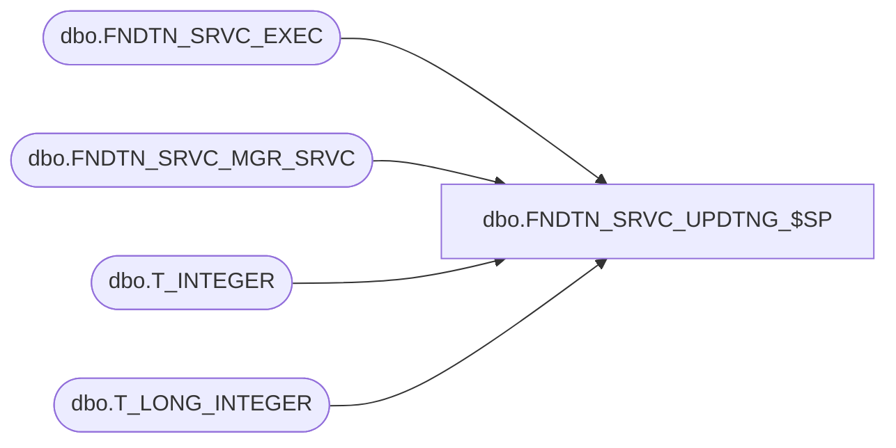

# dbo.FNDTN_SRVC_UPDTNG_$SP

**Database:** fn_01  
**Server:** bedrockdb02  

## Architecture Diagram



## Table Dependencies

| Referenced Table |
|---|
| dbo.FNDTN_SRVC_EXEC |
| dbo.FNDTN_SRVC_MGR_SRVC |
| dbo.T_INTEGER |
| dbo.T_LONG_INTEGER |

## Stored Procedure Code

```sql
CREATE PROCEDURE [dbo].[FNDTN_SRVC_UPDTNG_$SP]
```

