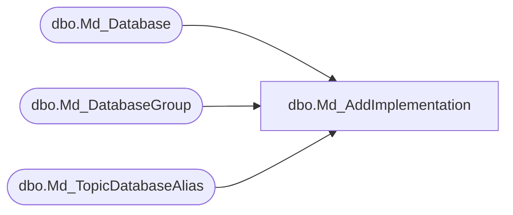

# dbo.Md_AddImplementation

**Database:** fn_01  
**Server:** bedrockdb02  

## Architecture Diagram



## Table Dependencies

| Referenced Table |
|---|
| dbo.Md_Database |
| dbo.Md_DatabaseGroup |
| dbo.Md_TopicDatabaseAlias |

## Stored Procedure Code

```sql

```

