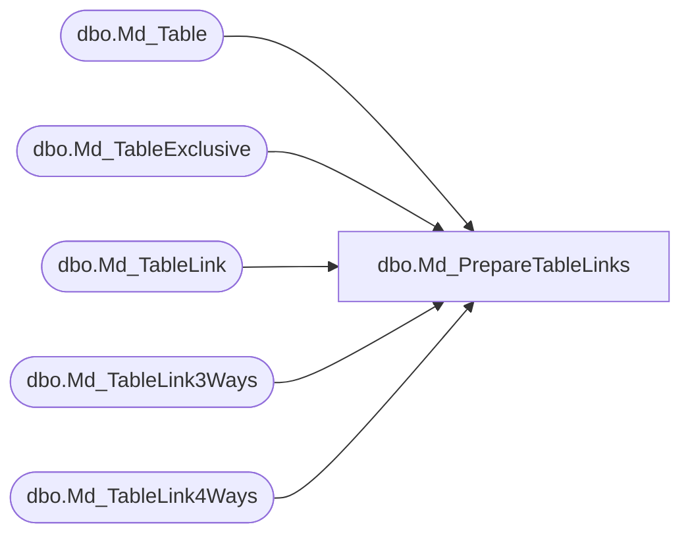

# dbo.Md_PrepareTableLinks

**Database:** fn_01  
**Server:** bedrockdb02  

## Architecture Diagram



## Table Dependencies

| Referenced Table |
|---|
| dbo.Md_Table |
| dbo.Md_TableExclusive |
| dbo.Md_TableLink |
| dbo.Md_TableLink3Ways |
| dbo.Md_TableLink4Ways |

## Stored Procedure Code

```sql

```

