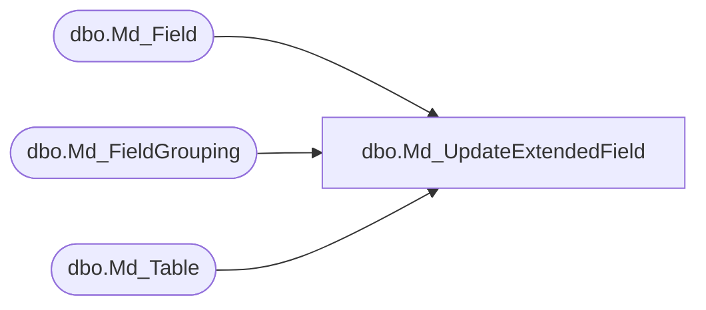

# dbo.Md_UpdateExtendedField

**Database:** fn_01  
**Server:** bedrockdb02  

## Architecture Diagram



## Table Dependencies

| Referenced Table |
|---|
| dbo.Md_Field |
| dbo.Md_FieldGrouping |
| dbo.Md_Table |

## Stored Procedure Code

```sql
CREATE PROCEDURE [dbo].[Md_UpdateExtendedField]
```

