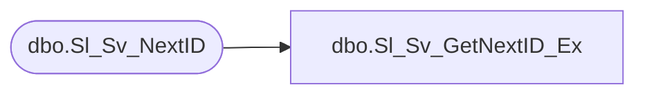

# dbo.Sl_Sv_GetNextID_Ex

**Database:** fn_01  
**Server:** bedrockdb02  

## Architecture Diagram



## Table Dependencies

| Referenced Table |
|---|
| dbo.Sl_Sv_NextID |

## Stored Procedure Code

```sql

```

