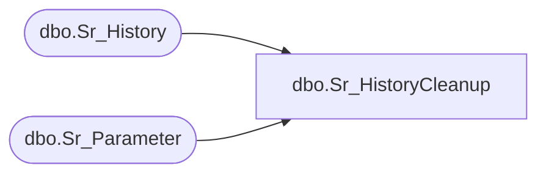

# dbo.Sr_HistoryCleanup

**Database:** fn_01  
**Server:** bedrockdb02  

## Architecture Diagram



## Table Dependencies

| Referenced Table |
|---|
| dbo.Sr_History |
| dbo.Sr_Parameter |

## Stored Procedure Code

```sql

```

