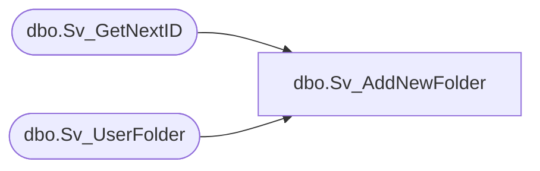

# dbo.Sv_AddNewFolder

**Database:** fn_01  
**Server:** bedrockdb02  

## Architecture Diagram



## Table Dependencies

| Referenced Table |
|---|
| dbo.Sv_GetNextID |
| dbo.Sv_UserFolder |

## Stored Procedure Code

```sql

```

