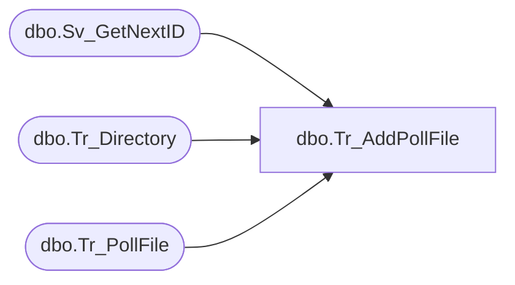

# dbo.Tr_AddPollFile

**Database:** fn_01  
**Server:** bedrockdb02  

## Architecture Diagram



## Table Dependencies

| Referenced Table |
|---|
| dbo.Sv_GetNextID |
| dbo.Tr_Directory |
| dbo.Tr_PollFile |

## Stored Procedure Code

```sql

```

