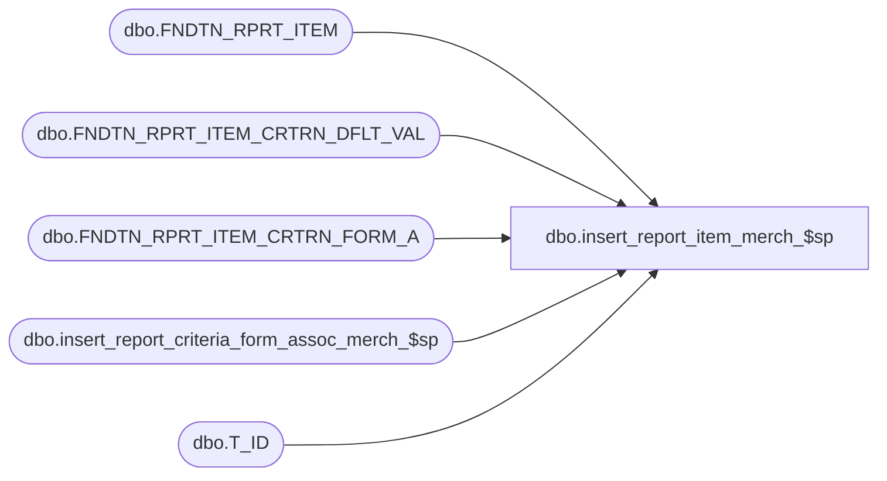

# dbo.insert_report_item_merch_$sp

**Database:** fn_01  
**Server:** bedrockdb02  

## Architecture Diagram



## Table Dependencies

| Referenced Table |
|---|
| dbo.FNDTN_RPRT_ITEM |
| dbo.FNDTN_RPRT_ITEM_CRTRN_DFLT_VAL |
| dbo.FNDTN_RPRT_ITEM_CRTRN_FORM_A |
| dbo.insert_report_criteria_form_assoc_merch_$sp |
| dbo.T_ID |

## Stored Procedure Code

```sql

```

