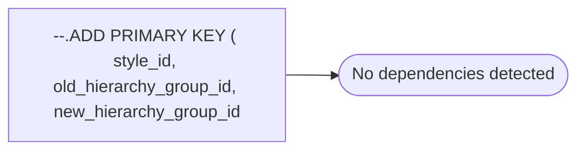

# --.ADD PRIMARY KEY ( style_id, old_hierarchy_group_id, new_hierarchy_group_id

**Database:** ma_01  
**Server:** bedrockdb02  

## Architecture Diagram



## Table Dependencies

_No table references detected._

## Stored Procedure Code

```sql

```

