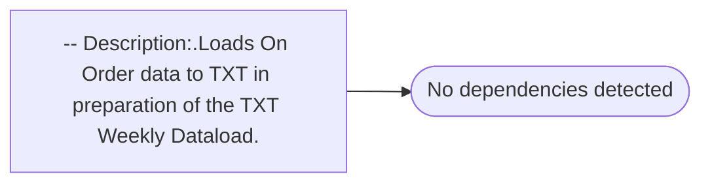

# -- Description:.Loads On Order data to TXT in preparation of the TXT Weekly Dataload.

**Database:** ma_01  
**Server:** bedrockdb02  

## Architecture Diagram



## Table Dependencies

_No table references detected._

## Stored Procedure Code

```sql

```

