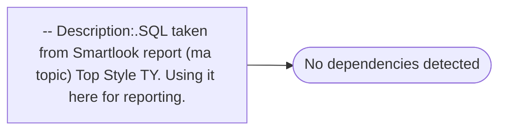

# -- Description:.SQL taken from Smartlook report (ma topic) Top Style TY. Using it here for reporting.

**Database:** ma_01  
**Server:** bedrockdb02  

## Architecture Diagram



## Table Dependencies

_No table references detected._

## Stored Procedure Code

```sql

```

