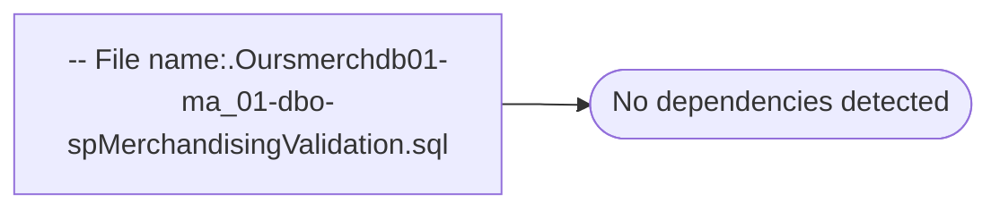

# -- File name:.Oursmerchdb01-ma_01-dbo-spMerchandisingValidation.sql

**Database:** ma_01  
**Server:** bedrockdb02  

## Architecture Diagram



## Table Dependencies

_No table references detected._

## Stored Procedure Code

```sql

```

