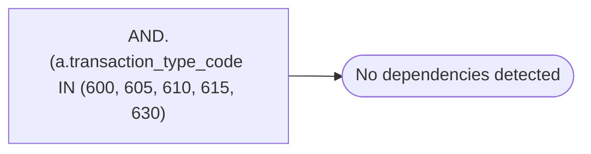

# AND.(a.transaction_type_code IN (600, 605, 610, 615, 630)

**Database:** ma_01  
**Server:** bedrockdb02  

## Architecture Diagram



## Table Dependencies

_No table references detected._

## Stored Procedure Code

```sql

```

