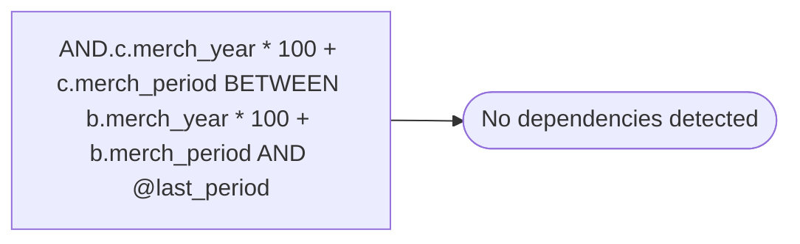

# AND.c.merch_year * 100 + c.merch_period BETWEEN b.merch_year * 100 + b.merch_period AND @last_period

**Database:** ma_01  
**Server:** bedrockdb02  

## Architecture Diagram



## Table Dependencies

_No table references detected._

## Stored Procedure Code

```sql

```

