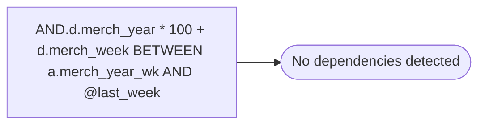

# AND.d.merch_year * 100 + d.merch_week BETWEEN a.merch_year_wk AND @last_week

**Database:** ma_01  
**Server:** bedrockdb02  

## Architecture Diagram



## Table Dependencies

_No table references detected._

## Stored Procedure Code

```sql

```

