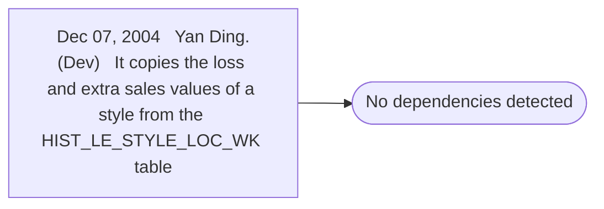

# Dec 07, 2004   Yan Ding.(Dev)   It copies the loss and extra sales values of a style from the HIST_LE_STYLE_LOC_WK table

**Database:** ma_01  
**Server:** bedrockdb02  

## Architecture Diagram



## Table Dependencies

_No table references detected._

## Stored Procedure Code

```sql

```

