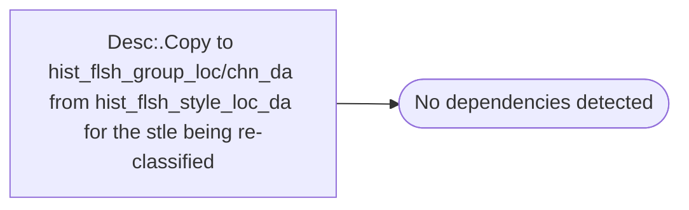

# Desc:.Copy to hist_flsh_group_loc/chn_da from hist_flsh_style_loc_da for the stle being re-classified

**Database:** ma_01  
**Server:** bedrockdb02  

## Architecture Diagram



## Table Dependencies

_No table references detected._

## Stored Procedure Code

```sql

```

