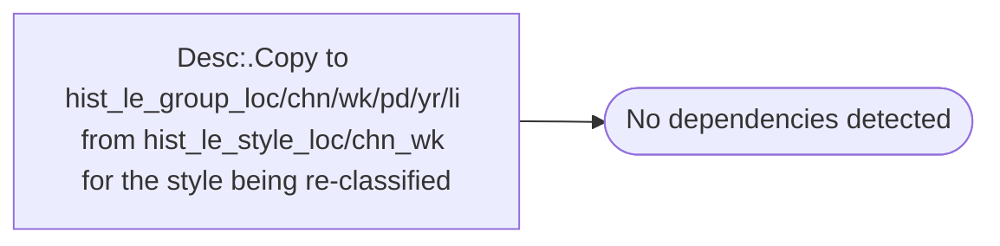

# Desc:.Copy to hist_le_group_loc/chn/wk/pd/yr/li from hist_le_style_loc/chn_wk for the style being re-classified

**Database:** ma_01  
**Server:** bedrockdb02  

## Architecture Diagram



## Table Dependencies

_No table references detected._

## Stored Procedure Code

```sql

```

