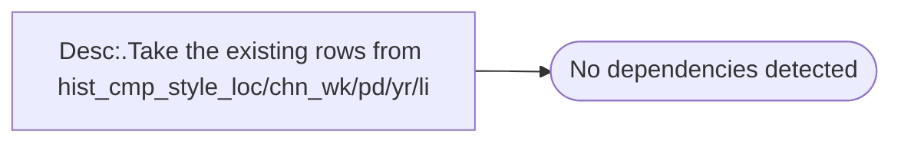

# Desc:.Take the existing rows from hist_cmp_style_loc/chn_wk/pd/yr/li

**Database:** ma_01  
**Server:** bedrockdb02  

## Architecture Diagram



## Table Dependencies

_No table references detected._

## Stored Procedure Code

```sql

```

