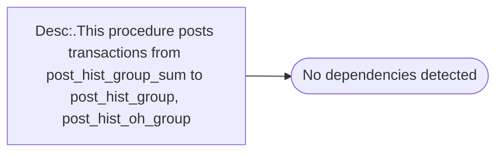

# Desc:.This procedure posts transactions from post_hist_group_sum to post_hist_group, post_hist_oh_group

**Database:** ma_01  
**Server:** bedrockdb02  

## Architecture Diagram



## Table Dependencies

_No table references detected._

## Stored Procedure Code

```sql

```

