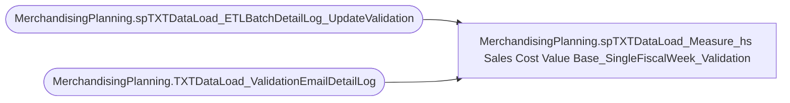

# MerchandisingPlanning.spTXTDataLoad_Measure_hs Sales Cost Value Base_SingleFiscalWeek_Validation

**Database:** ma_01  
**Server:** bedrockdb02  

## Architecture Diagram



## Table Dependencies

| Referenced Table |
|---|
| MerchandisingPlanning.spTXTDataLoad_ETLBatchDetailLog_UpdateValidation |
| MerchandisingPlanning.TXTDataLoad_ValidationEmailDetailLog |

## Stored Procedure Code

```sql

```

