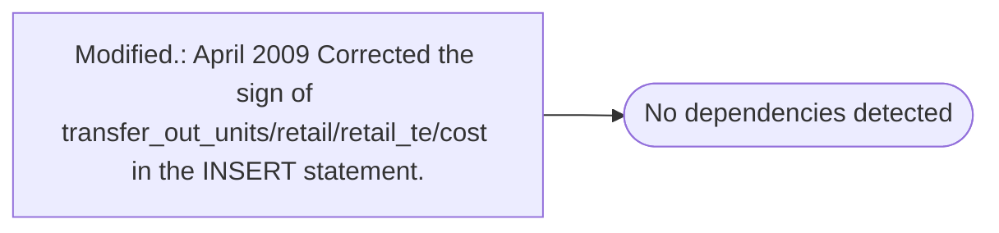

# Modified.: April 2009 Corrected the sign of transfer_out_units/retail/retail_te/cost in the INSERT statement.

**Database:** ma_01  
**Server:** bedrockdb02  

## Architecture Diagram



## Table Dependencies

_No table references detected._

## Stored Procedure Code

```sql

```

