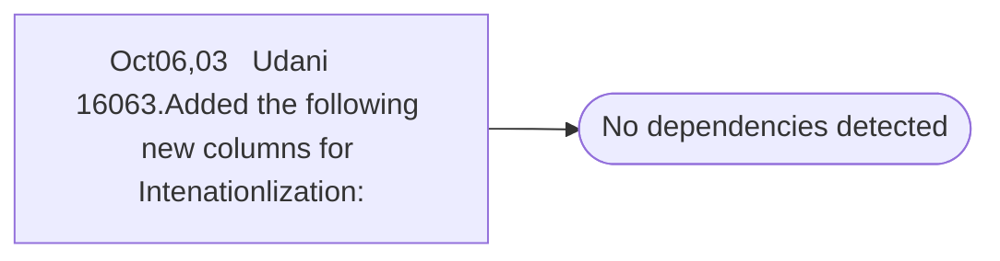

# Oct06,03   Udani        16063.Added the following new columns for Intenationlization:

**Database:** ma_01  
**Server:** bedrockdb02  

## Architecture Diagram



## Table Dependencies

_No table references detected._

## Stored Procedure Code

```sql

```

