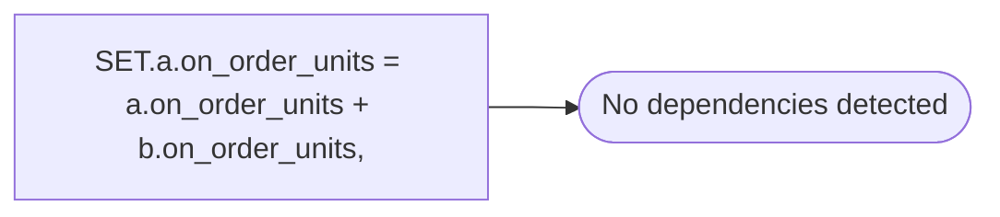

# SET.a.on_order_units = a.on_order_units + b.on_order_units,

**Database:** ma_01  
**Server:** bedrockdb02  

## Architecture Diagram



## Table Dependencies

_No table references detected._

## Stored Procedure Code

```sql

```

