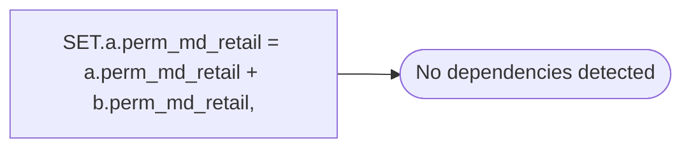

# SET.a.perm_md_retail = a.perm_md_retail + b.perm_md_retail,

**Database:** ma_01  
**Server:** bedrockdb02  

## Architecture Diagram



## Table Dependencies

_No table references detected._

## Stored Procedure Code

```sql

```

