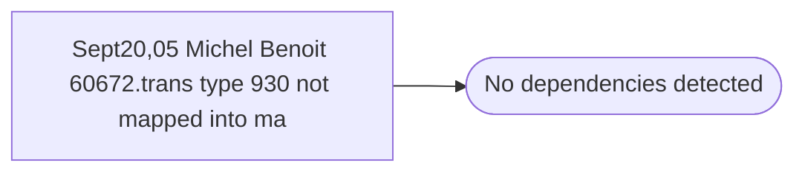

# Sept20,05 Michel Benoit 60672.trans type 930 not mapped into ma

**Database:** ma_01  
**Server:** bedrockdb02  

## Architecture Diagram



## Table Dependencies

_No table references detected._

## Stored Procedure Code

```sql

```

