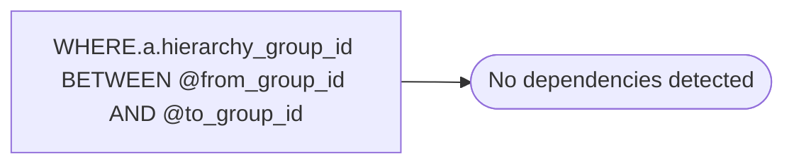

# WHERE.a.hierarchy_group_id BETWEEN @from_group_id AND @to_group_id

**Database:** ma_01  
**Server:** bedrockdb02  

## Architecture Diagram



## Table Dependencies

_No table references detected._

## Stored Procedure Code

```sql

```

