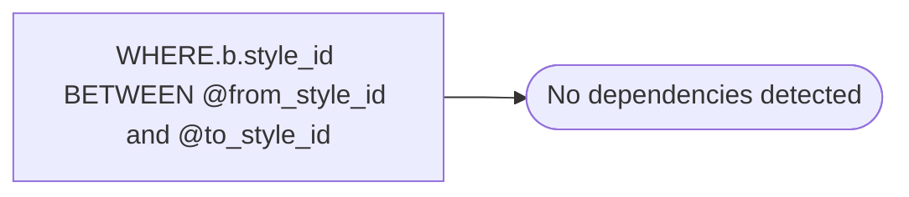

# WHERE.b.style_id BETWEEN @from_style_id and @to_style_id

**Database:** ma_01  
**Server:** bedrockdb02  

## Architecture Diagram



## Table Dependencies

_No table references detected._

## Stored Procedure Code

```sql

```

