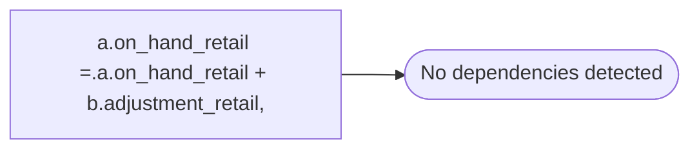

# a.on_hand_retail =.a.on_hand_retail + b.adjustment_retail,

**Database:** ma_01  
**Server:** bedrockdb02  

## Architecture Diagram



## Table Dependencies

_No table references detected._

## Stored Procedure Code

```sql

```

