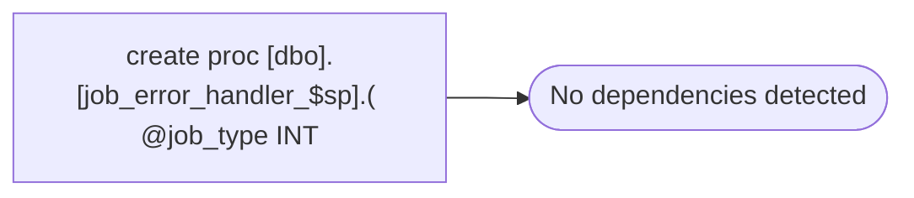

# create proc [dbo].[job_error_handler_$sp].( @job_type INT

**Database:** ma_01  
**Server:** bedrockdb02  

## Architecture Diagram



## Table Dependencies

_No table references detected._

## Stored Procedure Code

```sql

```

