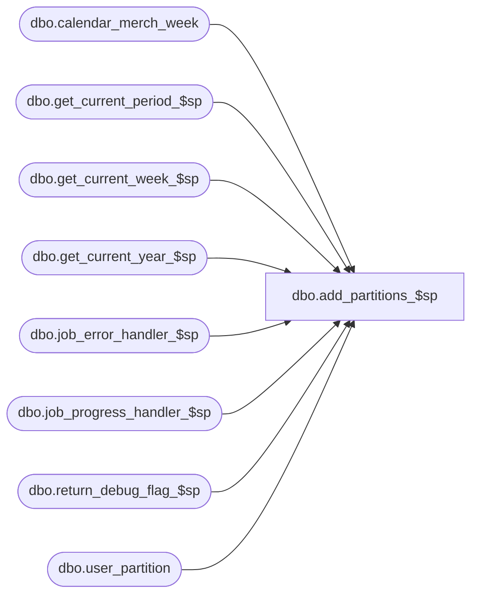

# dbo.add_partitions_$sp

**Database:** ma_01  
**Server:** bedrockdb02  

## Architecture Diagram



## Table Dependencies

| Referenced Table |
|---|
| dbo.calendar_merch_week |
| dbo.get_current_period_$sp |
| dbo.get_current_week_$sp |
| dbo.get_current_year_$sp |
| dbo.job_error_handler_$sp |
| dbo.job_progress_handler_$sp |
| dbo.return_debug_flag_$sp |
| dbo.user_partition |

## Stored Procedure Code

```sql

```

