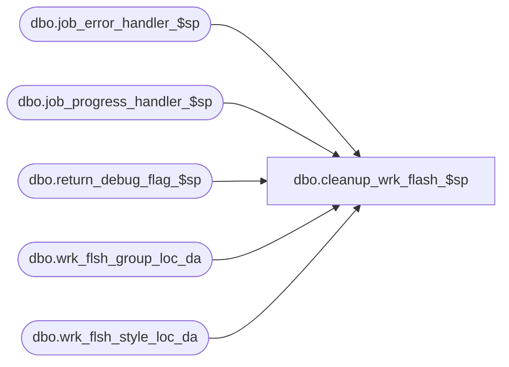

# dbo.cleanup_wrk_flash_$sp

**Database:** ma_01  
**Server:** bedrockdb02  

## Architecture Diagram



## Table Dependencies

| Referenced Table |
|---|
| dbo.job_error_handler_$sp |
| dbo.job_progress_handler_$sp |
| dbo.return_debug_flag_$sp |
| dbo.wrk_flsh_group_loc_da |
| dbo.wrk_flsh_style_loc_da |

## Stored Procedure Code

```sql

```

