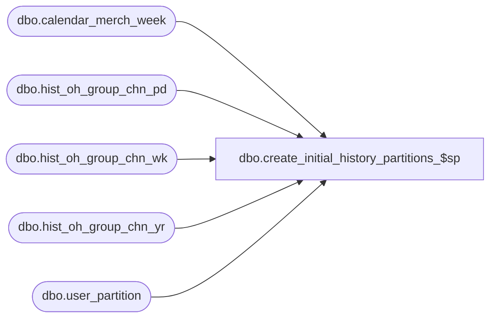

# dbo.create_initial_history_partitions_$sp

**Database:** ma_01  
**Server:** bedrockdb02  

## Architecture Diagram



## Table Dependencies

| Referenced Table |
|---|
| dbo.calendar_merch_week |
| dbo.hist_oh_group_chn_pd |
| dbo.hist_oh_group_chn_wk |
| dbo.hist_oh_group_chn_yr |
| dbo.user_partition |

## Stored Procedure Code

```sql

```

