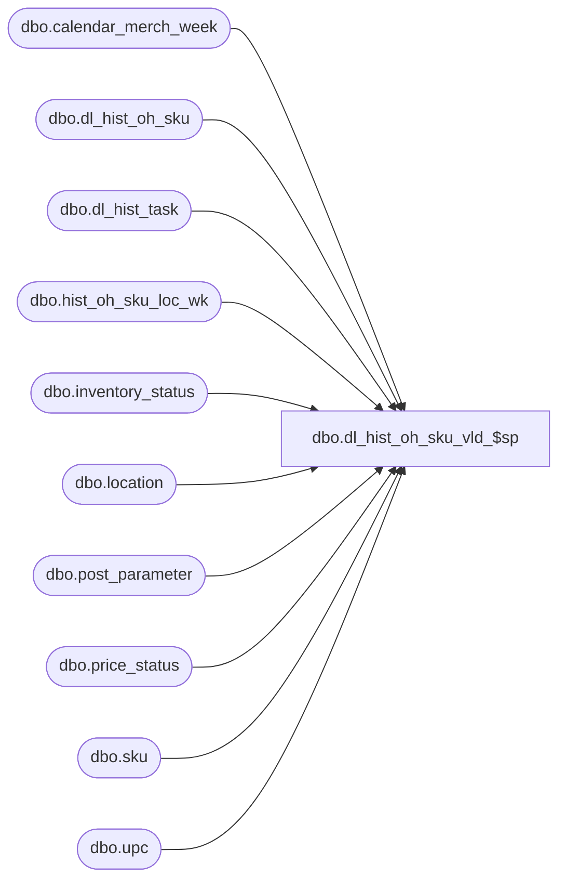

# dbo.dl_hist_oh_sku_vld_$sp

**Database:** ma_01  
**Server:** bedrockdb02  

## Architecture Diagram



## Table Dependencies

| Referenced Table |
|---|
| dbo.calendar_merch_week |
| dbo.dl_hist_oh_sku |
| dbo.dl_hist_task |
| dbo.hist_oh_sku_loc_wk |
| dbo.inventory_status |
| dbo.location |
| dbo.post_parameter |
| dbo.price_status |
| dbo.sku |
| dbo.upc |

## Stored Procedure Code

```sql

```

