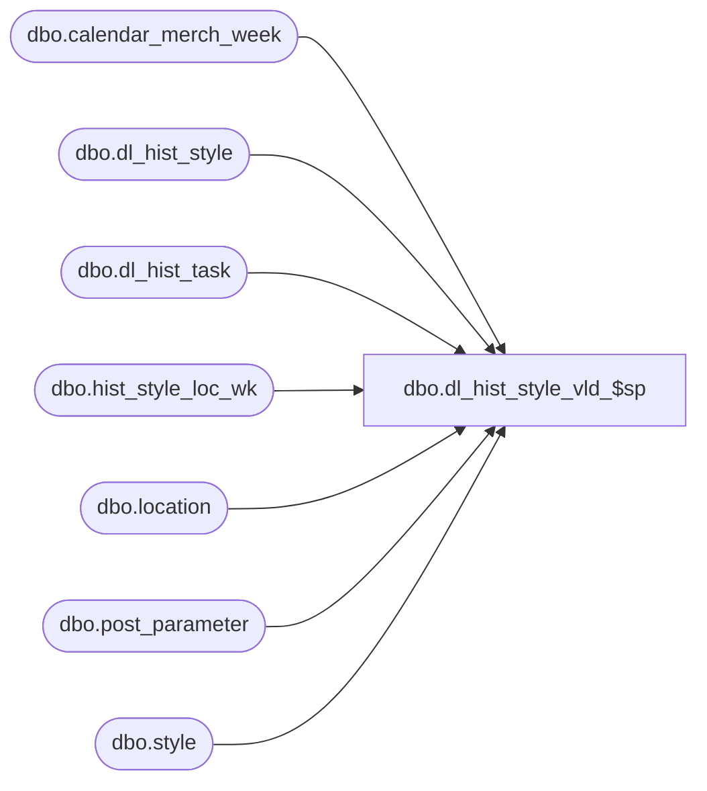

# dbo.dl_hist_style_vld_$sp

**Database:** ma_01  
**Server:** bedrockdb02  

## Architecture Diagram



## Table Dependencies

| Referenced Table |
|---|
| dbo.calendar_merch_week |
| dbo.dl_hist_style |
| dbo.dl_hist_task |
| dbo.hist_style_loc_wk |
| dbo.location |
| dbo.post_parameter |
| dbo.style |

## Stored Procedure Code

```sql

```

