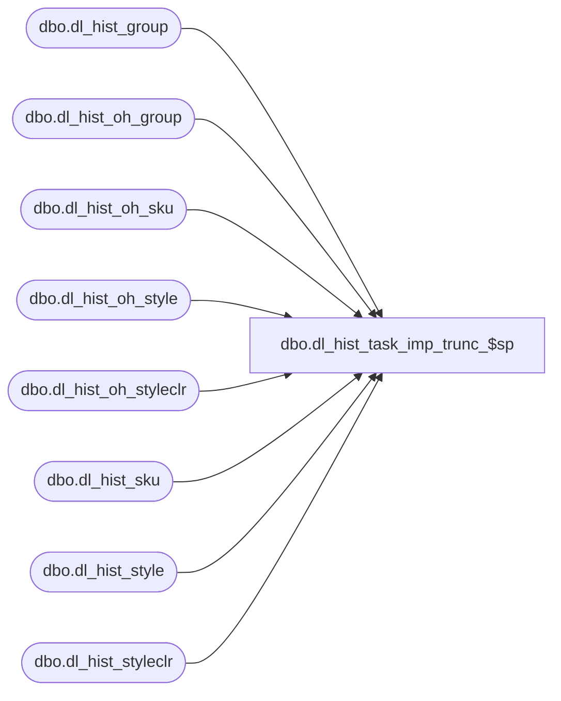

# dbo.dl_hist_task_imp_trunc_$sp

**Database:** ma_01  
**Server:** bedrockdb02  

## Architecture Diagram



## Table Dependencies

| Referenced Table |
|---|
| dbo.dl_hist_group |
| dbo.dl_hist_oh_group |
| dbo.dl_hist_oh_sku |
| dbo.dl_hist_oh_style |
| dbo.dl_hist_oh_styleclr |
| dbo.dl_hist_sku |
| dbo.dl_hist_style |
| dbo.dl_hist_styleclr |

## Stored Procedure Code

```sql

```

