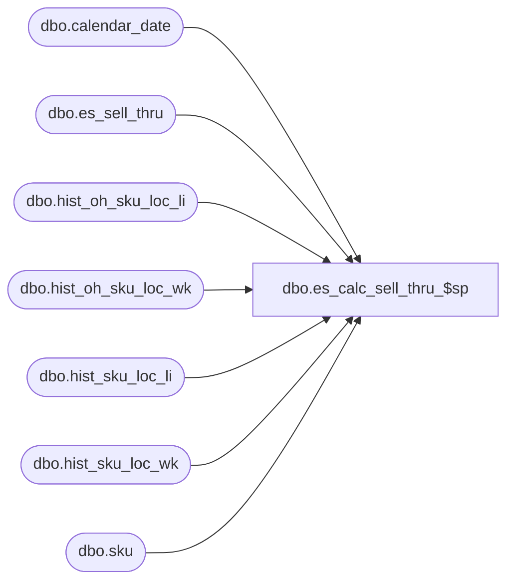

# dbo.es_calc_sell_thru_$sp

**Database:** ma_01  
**Server:** bedrockdb02  

## Architecture Diagram



## Table Dependencies

| Referenced Table |
|---|
| dbo.calendar_date |
| dbo.es_sell_thru |
| dbo.hist_oh_sku_loc_li |
| dbo.hist_oh_sku_loc_wk |
| dbo.hist_sku_loc_li |
| dbo.hist_sku_loc_wk |
| dbo.sku |

## Stored Procedure Code

```sql

```

