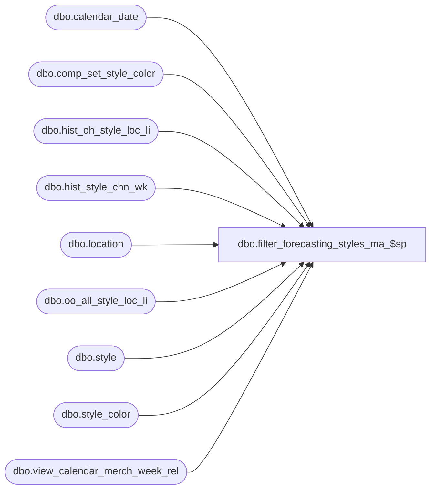

# dbo.filter_forecasting_styles_ma_$sp

**Database:** ma_01  
**Server:** bedrockdb02  

## Architecture Diagram



## Table Dependencies

| Referenced Table |
|---|
| dbo.calendar_date |
| dbo.comp_set_style_color |
| dbo.hist_oh_style_loc_li |
| dbo.hist_style_chn_wk |
| dbo.location |
| dbo.oo_all_style_loc_li |
| dbo.style |
| dbo.style_color |
| dbo.view_calendar_merch_week_rel |

## Stored Procedure Code

```sql

```

