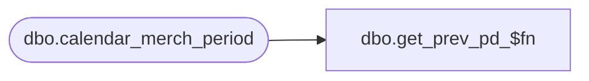

# dbo.get_prev_pd_$fn

**Database:** ma_01  
**Server:** bedrockdb02  

## Architecture Diagram



## Table Dependencies

| Referenced Table |
|---|
| dbo.calendar_merch_period |

## Stored Procedure Code

```sql

```

